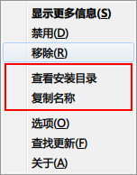
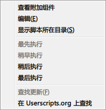
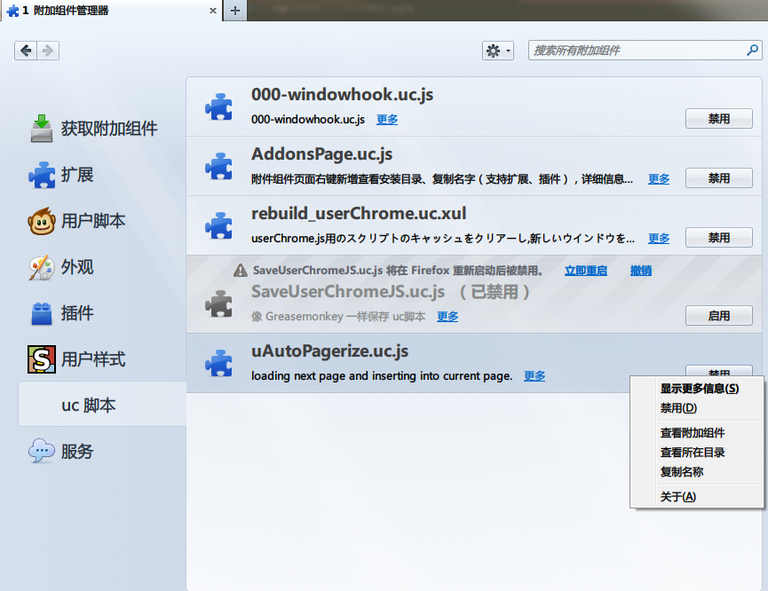
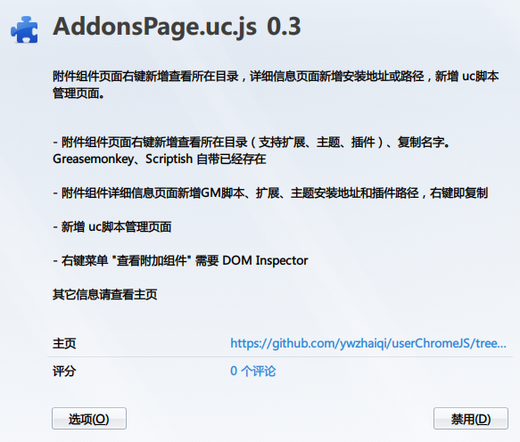
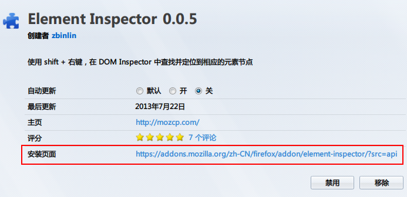

AddonsPage.uc.js
================

附件组件页面（about:addons）右键新增查看所在目录，详细信息页面新增安装地址或路径，新增 uc脚本管理页面。[卡饭论坛地址](http://bbs.kafan.cn/thread-1617407-1-1.html)

## 说明

 - 附件组件页面右键新增查看所在目录（支持扩展、主题、插件、uc脚本）、复制名字。Greasemonkey、Scriptish 自带已经存在。
 - 附件组件详细信息页面新增GM脚本、扩展、主题安装地址和插件路径，右键即复制。
 - 新增 uc脚本管理页面
 - 右键菜单 "查看附加组件" 需要 DOM Inspector

#### 右键菜单

#### uc脚本管理界面

 - 启用禁用需要 rebuild_userChrome.uc.xul
 - 详细页面新增的信息需要 [修改版userChrome.js](https://github.com/ywzhaiqi/userChromeJS/tree/master/userChrome.js)
 	- 新增对uc脚本多个参数的识别：`// @homepageURL`、`// @reviewURL`、`// @optionsURL`
 	- 需要脚本内的支持，我的一些脚本已经加上。
 - 编辑命令需要首先设置 view\_source.editor.path 的路径，可用网址 about:config?filter=view_source.editor.path 打开

#### 详细页面

### 添加图标

自行添加样式

	@namespace url(http://www.mozilla.org/keymaster/gatekeeper/there.is.only.xul);

	@-moz-document url("about:addons"), url("chrome://mozapps/content/extensions/extensions.xul") {
		#category-userchromejs > .category-icon {
			list-style-image: url(data:image/png;base64,iVBORw0KGgoAAAANSUhEUgAAABAAAAAQCAYAAAAf8/9hAAACk0lEQVQ4ja3RW0hTARwG8A+nEIIxI9DwyQtCarKj7vhkWEwj8AKahNR6siAispce6k2y9VJvIblpkBOt4xGU5ko0RKZuecMLedlxTk0ym7Y5TcvL10OmKwuC+uB7/fG/AP8jarWaERERNBgMDxsbG4uMRuMdQRB4WH2MGdog0gvuuL+XbnDLDW66wQNAeXl5mSzLeUajsVQQhHW1+gjFtPgNn6d2Yl6pdM4rlc53U8/G/a4T/q2/A9RMS0tfXfR86ZpwLjgmnAuOMYU27/TZpe0/AQ0NDbkmk+nGPpC25vF47Iqi9CmK0jfh9PV4p7OWDwCRkZEsKysz1NfXF1VUVNzaA7TatSXvcs+Uy9WruFy9k9P+bt9M9vLO3C9AXFwcBUGgKIrMyMhgYmIij4aFMT05+fPk0NDAQGfn8LDNNjzUNdb/seekd90eAKiCwxkVFc2EhOPUaDTUiiLjYmKYAvAMwHyAJQDvAqwE2IwgOqDaB87nH2JRgbhaUFj8tbi4ePWiXv8pLyfHJwDMBli4C5QDNAG0AOxHwATcACcHr483NXeNWSyWPovV2tnUKPekAMwCeCk01HNPp7M8ysxsq9Hp2pp1urYOne71PjAPvum44jLXWTslSbJLsuyoNdf0pQA8BbBUo3FY7fZkyWrNrNutuaUl+zfAyy5Jeu4IBE4DvJaUNNTQ3p77RJb1JlnWV8qy/rEslfwEdLffdFY9dXSY617ZzPWtturqpr0VLoSE+G+npg4+EIRRo1Y7Kmm1o62i+HYP2JoBl8fD19+PxPs+jMSuLI7Grrjt0f6U3SOeA3gZoAFgFcAWgAOBR9x0g9szIGfBnVmQc+DqGPgDKAJ4FeB9gFXBwXyhUrFXFfDGf8k3RzmjBlDWo+YAAAAASUVORK5CYII=);
		}
	}

## 参考

 - [Add InstallUrl Or Path To AddonsPage 脚本 By Crab](http://j.mozest.com/zh-CN/ucscript/script/109/)
 - [Add-ons Manager Context Menu 扩展](https://addons.mozilla.org/zh-cn/firefox/addon/am-context/)
 - OpenAddonFolder.uc.js
 - Greasemonkey 和 Scriptish 扩展
 - Firefox 源代码

## 写这个脚本的说明

 - AM 扩展菜单太多了，在 Scriptish 页面更加混乱，且没有安装链接
 - AM 扩展不支持查看 plugin 的路径