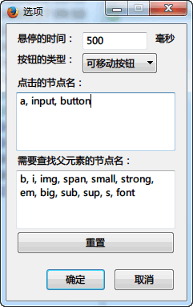

AutoClickModY.uc.js
===================

鼠标悬停自动点击链接、按钮、图片。AutoClick.uc.js 修改版。

 - 可选3种形式：地址栏按钮、可移动按钮、菜单。 鼠标左键点击：启用禁用，右键点击：打开设置窗口。
 - 第一次需要从定制面板中拖出
 - 当按着 Ctrl 键时，默认 firefox 设置是后台打开。但如果修改了 `browser.tabs.loadInBackground = false`，则会前台打开。
 - 菜单默认在菜单栏的工具菜单中， ID 为 `AutoClick-enable-menuitem`，可添加到 rebuild_userChrome 中。
 - 鼠标手势或其它调用命令：`document.getElementById("AutoClick-enable-menuitem").click();`。

#### 设置窗口

