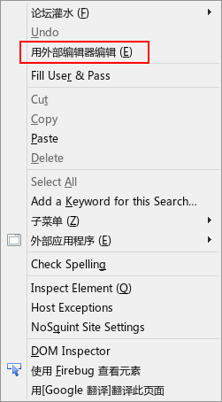

ucjs_editor.uc.js
=================

输入框右键添加 "用外部编辑器打开" 功能，同类扩展It's All Text!。只适用于Firefox主窗口，FireGestrues编辑脚本窗口、Stylish编辑窗口（请用stylish0.5\_edit.uc.js）无效。

 - 第55行 \_editor 为编辑器的路径，如果空则为 about:config 中 "view_source.editor.path" 的路径。

 [原作者地址（日文）](https://github.com/alice0775/userChrome.js/blob/master/010-ucjs_editor.uc.js)