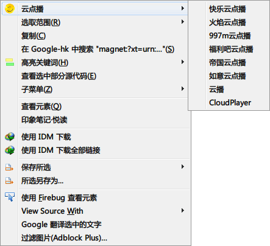

## yunPlayer.uc.js 右键云点播

## ExternalVideoPlayer.uc.js

调用外部播放器播放网络视频。

### 使用

在支持的站点通过右键菜单调用。

 - 菜单直接点击用外置播放器播放视频（清晰度为 flvcd 网站设置的清晰度）。
 - 菜单二级菜单可以选择清晰度。

### 原理

先通过 flvcd.com 解析得到地址列表，然后调用本地播放器播放。

### 支持调用的网站

优酷网、音悦台、乐视网、腾讯视频、酷6网、56网、迅雷看看、PPS、新浪视频、网易视频、激动网、糖豆网、百度贴吧视频、华数TV

### 不支持播放的网站默认打开 flvcd 解析页面

土豆网、奇艺网、搜狐视频、PPTV

### 说明

 - 脚本内 `PLAYER_PATH` 为播放器路径。如果为空或调用失败，则会打开播放列表文件。

播放列表文件的格式

  - 默认为 asx，可通过设置系统关联更改播放器。
  - mplayer、Smplayer 为 pls
  - vlc 为 xspf，可能效果最好。
  - 如果为 BaiduPlayer，则会启动播放器并复制链接到剪贴板。

### 更新

 - 2013年10月02日
    - 从
 - 2013年6月22日
    - 增加二级菜单清晰度的选择
    - 完善修改代码