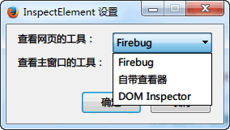
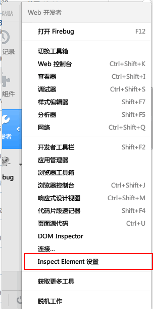

InspectElementModY.uc.js
========================

元素查看调用工具，在需要查看的元素上按“Shift + 鼠标右键”调用。[Element Inspector :: Firefox 附加组件](https://addons.mozilla.org/zh-CN/firefox/addon/element-inspector/?src=search) 增强版。

**推荐使用下面的扩展，uc 脚本可能并不是最新的。**

 - 不同于 inspectElement.uc.js 脚本，本脚本提取自扩展。解决了原 uc 脚本其它窗口无效的问题。
 - 新增设置界面，可分别选择网页、主窗口的查看器（Firebug 是最优选择），其它窗口需要 DOM Inspector。
 - 打开设置的菜单在 `开发者` 菜单中。ID 为 `InspectElement-menuitem`，可添加至 rebuild_userChrome。
 - 新增功能：使用已经存在的查看器。如果 Firebug 或自带查看器已经在使用，则会重用，并不会打开新的查看器。
 - 如果使用了 StrokesPlus 会失效。需要把 firefox 加入到排除列表。
 - 需要 Firefox 20+

xpi
----

是直接修改 Element Inspector 扩展，好处是启用停用无需重启。

 - 已知问题：ff30 在图中菜单点击无效，而 ff31 有效。ff30 请到工具 -> web开发者 菜单中点击或附加组件选项点击。