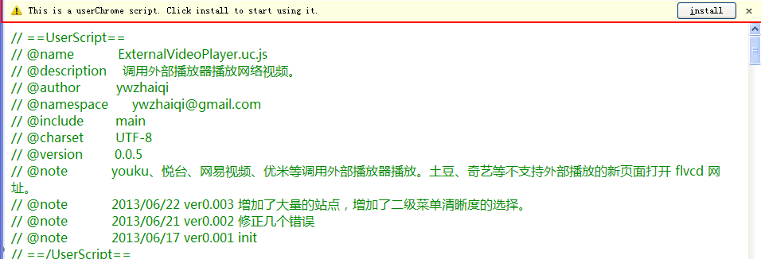
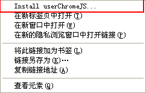
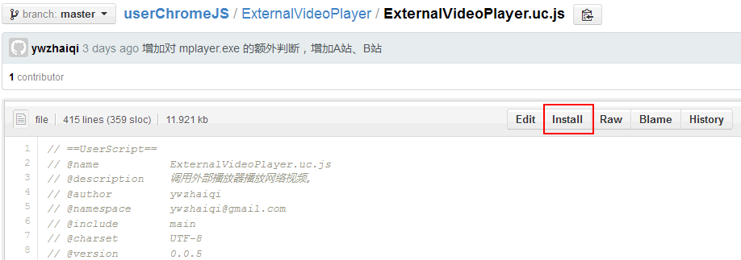

SaveUserChromeJS.uc.js
======================

像 Greasemonkey 一样保存 uc脚本。

 - 打开符合的脚本链接，页面顶部会有安装提示条。
 - 在符合的链接上右键增加 `Install userChromeJS...` 菜单。
 - 在 GitHub 符合的页面增加 `Install` 按钮。
 - 保存后无需重启自动启用（仅支持 uc.js，默认禁用，一些脚本有问题，重启后解决）

 注意：文件保存完后需要重启生效。

