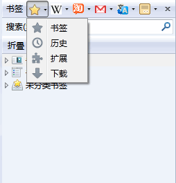

SidebarModfix.uc.js
===================

侧边栏增强，基于 [lastdream2013 的版本](http://bbs.kafan.cn/thread-1552255-1-1.html)。

 - 更改了一些图标为 Firefox 默认图标
 - 更改了图标获取顺序，现在的获取顺序 style > favicon > 第一个子图标
 - 新增了一些站点
 - 增加了鼠标中键在标签页打开链接

 