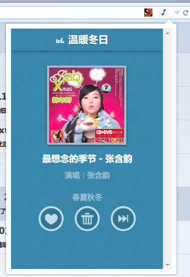
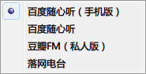

SimpleMusicPlayer.uc.js
=======================

简单音乐播放面板，支持多个站点，参考了百度随心听播放栏UC脚本。

- 只有一个按钮，默认在地址栏，点击弹出面板，右键弹出站点菜单。
- 内置多个站点配置，可设置面板大小，是否设置 UA 为手机版，插入该站点的样式。
- [关于百度随身听的音质 - 卡饭论坛](http://bbs.kafan.cn/thread-1738286-1-1.html)

### 弹出面板

### 右键菜单

### 关于设置 UA 为手机版

- 在网址载入前会临时设置 UA 为手机版 firefox，然后马上复原。
- 在这个短暂的时间内，请不要在主界面打开网址，会被影响到。

站点配置
-------

站点示例，更多示例请查看代码。

	{
		name: "百度随心听（手机版）",
		url: "http://fm.baidu.com/",
		changeUA: true,
		iframeStyle: "mobile",
		css: "#ad { display:none !important; }",
	},

- **name**: 右键菜单显示的名字。
- **url**: 面板载入的网址。
- **changeUA**: 会临时设置 UA 为手机版，如果不需要不要填。
- **iframeStyle**: 主要用于设置面板的宽度和高度，`mobile` 为内置的 mobile 大小，也可自行设置，例如 `width: 740px; height: 570px;`
- **css**: 插入到页面的样式，可隐藏广告或简化网站的界面使得弹出的面板变小。

TODO
----

### 豆瓣FM 的问题

- [豆瓣FM](http://douban.fm/) 和 [豆瓣FM（手机版）](http://douban.fm/partner/sidebar) 在面板里点击按钮无反应，是因为 iframe 的原因？
- 目前用窗口方式解决。

### Flashgot 捕获音频？

需要修改 Flashgot 扩展的代码？

文件 MediaSniffer.js

	updateUI: function (win) {
		var bw = DOM.mostRecentBrowserWindow;
		if (bw && bw.gFlashGot && bw.content == win.top) bw.gFlashGot.updateMediaUI();
	},