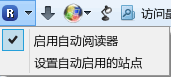

autoLanuchReader.uc.js
======================

通过点击按钮调用阅读扩展或脚本进行阅读，也可通过添加地址自动调用。

## 特性

 - 点击按钮手动调用阅读工具。
 - 输入地址后，在启用模式下，匹配地址会自动调用。

## 支持的阅读工具

按照顺序查找，如果都找不到则调用 `Readability 在线版`

 1. [小说阅读脚本 for Greasemonkey](https://userscripts.org/scripts/show/165951)
 2. [Evernote Clearly :: Firefox 附加组件 - Mozilla Add-ons](https://addons.mozilla.org/zh-cn/firefox/addon/clearly/)
 3. [Readability 中文增强版 for Greasemonkey](https://userscripts.org/scripts/show/163581)
 4. Readability 在线版

## 说明

按钮左键点击调用阅读工具，右键点击弹出菜单，`设置自动启用的站点` 点击后弹出设置对话框。

#### 启用禁用自动阅读

#### 弹出菜单

#### 设置自动启用站点对话框

**输入框1**：按`确定键`输入结果，地址经过简单处理，`原始地址`显示当前页面的地址（未处理），用 `*` 匹配地址，示例：http://www.cnbeta.com/articles/*.htm

**输入框2**：全部地址，一行一个匹配地址。

## 调用命令

    autoReader.launch();