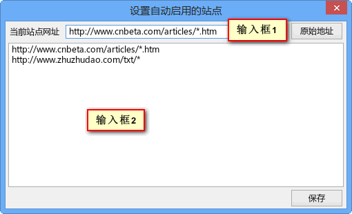

autoLanuchReader.uc.js
======================

通过按钮点击调用阅读扩展或脚本进行阅读，也可通过添加地址自动调用。

## 说明

按钮左键点击调用阅读工具，右键弹出菜单，其中 `设置自动启用的站点` 点击后弹出设置对话框。

**自动阅读器 启用和禁用2种状态**

**按钮右键弹出菜单**

**设置自动启用站点对话框**

## 支持的阅读工具

可用的扩展或脚本或地址。按照下面的顺序进行查找。

 1. **小说阅读脚本**
 2. **Evernote Clealy**
 3. **Readability 脚本**
 4. **Readability 在线版**
 5. **Instapaper 在线版**
 6. **Readable 在线版**

## 调用命令

    autoReader.launch();