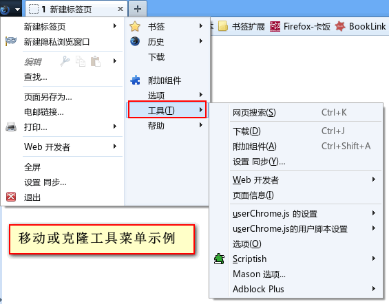

moveButton.uc.js
================

功能：移动或克隆按钮/菜单到任意位置

建议只移动不可移动的按钮。如果移动后位置不正确可能用css固定了，如果移动后出现空白

填写的 buttons 说明
-------------------

    id: 要移动的按钮或菜单的 Id， 也可以是 css 选择器。

示例1： 移动 "翻译按钮" 到 "scriptish按钮" 的前面

    { id: "translatorButton", insertBefore: "scriptish-button" },

示例2： 移动 "翻译按钮" 到 "scriptish按钮" 的后面

    { id: "translatorButton", insertAfter: "scriptish-button" },

示例3： 移动 "翻译按钮" 到 "附加组件栏" 的第一个位置

    { id: "translatorButton", bar: "addon-bar", pos: 1 }

示例4：移动 "翻译按钮" 到 原来的第一个位置。（不推荐，建议用css调整）

    { id: "translatorButton", pos: 1 }

示例5：移动 "工具菜单" 到 系统按钮弹出的菜单 "选项" 的下面。

    { id: "tools-menu", insertAfter: "appmenu_customize"}

示例6：克隆 "工具菜单" 到 系统按钮弹出的菜单 "选项" 的下面。

    { id: "tools-menu", insertAfter: "appmenu_customize", clone: true }

示例7：修改 Greasemonkey 按钮为右键弹出菜单的类型

     {id: "greasemonkey-tbb",
        attr: {
            type: "",
            context: "_child"
        }
    },

示例8：改 User Agent Overrider 按钮为右键弹出菜单

    {id: "useragentoverrider-button",
        attr: {
            type: "",
            context: "_child"
        }
    },

示例9：增加 Stylish 按钮右键点击弹出菜单的功能

    {id: "stylish-toolbar-button",
        attr: {
            context: "stylish-popup"
        }
    },

参考的工具栏或按钮的Id
-----------------------

    nav-bar（导航工具栏）
        unified-back-forward-button（前进后退按钮）
        urlbar-container（整个地址栏）
            urlbar-icons（地址栏图标，如地址栏下拉按钮、刷新按钮等，uc脚本一般插入的位置）
        search-container（整个搜索栏）
        home-button（主页按钮）

    PersonalToolbar（书签栏）
        personal-bookmarks（书签栏中书签部分）
    addon-bar（附加组件栏）
        status-bar（状态栏，在附加组件栏中，按钮为不可移动）

主要参考了 addMenu.uc.js 和 rebuild_userChrome.uc.xul