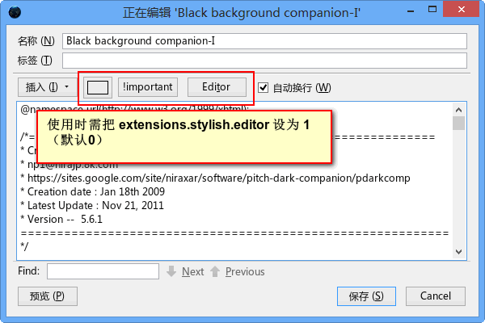

stylish0.5_edit.uc
==================

为 Stylish 增加外部编辑器、颜色选择、添加 !important 功能。 **修复了原脚本只能在纯文本下编辑的情况（即使用时需把 extensions.stylish.editor 设为 1，默认为0）。现在无需设置也能使用。**

## 说明

 - 需要有 000-windowhook.uc.js 这个脚本。
 - 如果没有反应，请设置 第63行 "EDITOR\_PATH" 路径 或 about:config 中 "view_source.editor.path" 路径。类似：
    `var EDITOR_PATH = "C:\\Program Files\\Sublime Text 2\\sublime_text.exe";`
 - Stylish有个bug，中文输入法下输入的会为空，请切换输入法。

 [原作者地址（日文）](https://github.com/alice0775/userChrome.js/blob/master/stylish0.5_edit.uc.js)