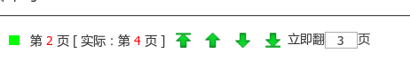
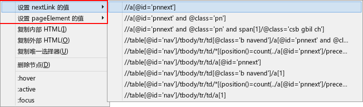

uAutoPagerize 中文规则版
========================

### uAutoPagerize.uc.js（深度修改）

基于 [Griever 的 uAutoPagerize](https://github.com/Griever/userChromeJS/tree/master/uAutoPagerize) 修改，参考了 [Super\_preloader](http://userscripts.org/scripts/show/84937)。[卡饭帖子地址](http://bbs.kafan.cn/thread-1555846-1-1.html)

 - 新增 **[Super\_preloader.db](https://userscripts.org/scripts/show/142198) 规则的支持**，几乎完美兼容该规则，支持 `auto;`、`css;`、函数、地址栏递增等多种方式
 - 能下载更新 Super\_preloader.db 的规则，文件名为 `uSuper_preloader.db.js`（Chrome目录下）
 - 新增 **本人维护的规则**，也可添加多个他人规则。以上所有规则都可通过 `更新中文规则` 更新
 - 新增 **iframe加载下一页**（浏览器级，默认只启用 JavaScript、Image，节省资源），可以支持一些特殊网站：如起点或漫画网站
 - 新增 **立即加载n页** 功能
 - 新增 **强制拼接** 功能，在没有规则且能通过自动查找找到下一页链接的才可用
 - 新增 **提前预读** 功能，就是翻完第1页,立马预读第2页,翻完第2页,立马预读第3页..(大幅加快翻页快感-_-!!)
 - 新增 **最大翻页数** 的设置
 - 新增 **实际网页数**，来自 lastDream2013
 - 新增 **AutoPager Rules 搜索** 功能
 - 原官方规则优先级最低，默认启用。略大，但很多网站都可翻页。可设置为禁用 `var ORIGINAL_SITEINFO = false`
 - 默认为可移动按钮，可在 `isUrlbar` 更改，true为地址栏，false为附加组件栏（可移动按钮）

#### 特殊的支持

由于下面的修复是通过研究网页代码而来，网页改版可能会造成失效，请反馈

 - *百度贴吧* 修复下一页图片的点击放大和回复按钮的可用
 - *Google 搜索* 修复下一页图片或视频缩略图
 - *VeryCD 搜索* 修复下一页图片
 - *youtube 搜索* 修复下一页图片
 - *天涯论坛帖子* 修复下一页只看楼主
 - *抽屉新热榜* 修复下一页图片，推荐、收藏、评论点击

#### 按钮右键菜单

#### 分页导航

### SITEINFO_Writer.uc.js（深度修改）

 - 大幅修改以适应 uAutoPagerize 中文规则增强版
 - 移植了 **AutoPager 的自动识别** 功能
 - 自带的开发工具右键新增 **设置 nextLink 的值** 和 **设置 pageElement 的值** 功能
 - AutoPager Rules 网站新增 **点击 `install` 读取规则并弹出对话框**
 - 新增 **读取当前页面规则** 的功能，当前页面已经运行的规则会加粗
 - 新增 **从剪贴板读取规则** 的功能
 - 新增 **查看规则(SP)** By lastdream2013，导出规则为 Super_preloader 格式
 - 新增 **useiframe**
 - 新增 **auto; 或 css; 写法的支持**
 - 新增 **用Firebug 或自带开发工具查看元素**
 - 修改选取的 xpath 获取方式为 AutoPager 方式

#### 自带开发工具右键菜单

## 文件简介

 - [uAutoPagerize.uc.js](uAutoPagerize.uc.js)，脚本文件。
 - [_uAutoPagerize.js](_uAutoPagerize.js)，自己的配置文件，可设置排除列表，添加规则。
 - [SITEINFO_Write.uc](SITEINFO_Writer.uc.js)（非必须），规则辅助查找工具（修改版），在 AutoPager Rules 网站点击 install 后自动读取规则并弹出对话框。
 - AutoPagerizeFindHighlight.uc.js（辅助，非必要）。google搜索等下一页高亮的修正。使用我修改过的 WordHighlightToolbar.uc.js 则不需要。
 - AutoPagerize_IDE.js，AutoPagerize的书签工具，暂不可用。

## 使用注意

 - 如果加载的下一页以图片为主，内存占用会不断加大（文字则完全不受影响）。建议点击 第 XX 页 链接，关闭当前页面，继续阅读。
 - 按钮图标鼠标中建载入自己的配置，右键弹出菜单
 - Super_preloader 规则和本人维护的规则都存放在 Google code，下载不了规则的请修改 host

## 添加排除列表

在文件 _uAutoPagerize.js 中，模仿下面的格式添加

    // 排除列表
    var EXCLUDE = [
        'https://mail.google.com/*'
        ,'http://www.google.*/reader/*'
    ];

## 改为极简分隔条

    var SIMPLE_SEPARATOR = true;  // true 极简分隔条，false 多功能分隔条

## 配合鼠标手势或其它工具调用的代码

#### 启用禁用

	uAutoPagerize.toggle()

#### 立即加载3页

    var node = FireGestures.sourceNode;
    var doc = node.ownerDocument || getBrowser().contentDocument;
    var win = doc.defaultView;

    if(win.ap)
        win.ap.loadImmediately(3);

#### 上一页（无，可调用 nextPage.uc.xul）

    if(window.nextPage)
        nextPage.next();

#### 下一页（3合1，如果不存在则调用 nextPage.uc.xul）

    var node = FireGestures.sourceNode;
    var doc = node.ownerDocument || getBrowser().contentDocument;
    var win = doc.defaultView;

    if(win.ap){
        let nextURL = win.ap.nextLink && win.ap.nextLink.href;
        if(nextURL)
            win.location = nextURL;
    }else if(win.uSuper_preloader){
        win.uSuper_preloader.go();
    }else if(window.nextPage){
        nextPage.next(true);
    }

#### 向上滚一页（4合1）

依次查找：uAutoPagerize、uSuper_preloader、小说阅读脚本、FireGestures滚到底部。其中用了通用的查找分隔符的方法

    var node = FireGestures.sourceNode;
    var doc = node.ownerDocument || getBrowser().contentDocument;
    var win = doc.defaultView;

    if(win.ap){
        uAutoPagerize.gotoprev(win);
    }else if(win.uSuper_preloader){
        win.uSuper_preloader.goPre();
    }else if(doc.body.getAttribute("name") == "MyNovelReader"){  // 小说阅读脚本
        uAutoPagerize.gotoprev(win, ".chapter-footer-nav");
    }else{
       FireGestures._performAction(event, "FireGestures:ScrollTop");
    }

#### 向下滚一页（4合1）

同上

    var node = FireGestures.sourceNode;
    var doc = node.ownerDocument || getBrowser().contentDocument;
    var win = doc.defaultView;

    if(win.ap){
        uAutoPagerize.gotonext(win);
    }else if(<win class="uSuper_preloade"></win>r){
        win.uSuper_preloader.goNext();
    }else if(doc.body.getAttribute("name") == "MyNovelReader"){  // 小说阅读脚本
        uAutoPagerize.gotonext(win, ".chapter-footer-nav");
    }else{
       FireGestures._performAction(event, "FireGestures:ScrollBottom");
    }

## 站点配置说明

    {   name: 'Google搜索',
        url: '^https?\\:\\/\\/(www|encrypted)\\.google\\..{2,9}\\/(webhp|search|#|$|\\?)',  //url 2种方式：正则和普通 * 号方式
        // url: 'wildc;http*://www.google.com.hk/search*',

        nextLink: 'auto;',  // 下一页链接 xpath 或者 CSS选择器 或者 函数返回值(此函数必须使用第一个传入的参数作为document对象) (~~必选~~)
        //nextLink: '//table[@id="nav"]/descendant::a[last()][parent::td[@class="b"]]',
        //nextLink: 'css;table#nav>tbody>tr>td.b:last-child>a',
        //nextLink: function(D,W){return D.evaluate('//table[@id="nav"]/descendant::a[last()][parent::td[@class="b"]]',D,null,XPathResult.FIRST_ORDERED_NODE_TYPE,null).singleNodeValue;},

        useiframe:false,   // 是否使用iframe翻页(可选)
        iloaded:false,     // 是否在iframe完全load之后操作..否则在DOM完成后操作(可选)

        //pageElement: '//div[@id="ires"]',  //主体内容 xpath 或 CSS选择器 或函数返回值(~~必须~~)
        pageElement: 'css;div#ires, div#res',
        //pageElement:function(doc,win){return doc.getElementById('ires')},
    },

## 高级规则说明

对原页面或下一页的处理，`this`: 网页window，`this.wrappedJSObject`: 网页window对象，`this.console`: 控制台

 - `startFilter(win, doc)`: 对原页面的处理，这个的前提是能顺利找到 nextLink, pageElement
 - `requestFilter(opt)`: 对 GM_xmlhttpRequest 参数的处理
 - `responseFilter(res, requestURL)`: 对接收到的 response 对象处理
 - `documentFilter(doc, requestURL, info)`: 对下一页的 document 对象处理
 - `fragmentFilter(fragment, doc, pages)`: 对规则找到的 pageElements 而创建的 fragment 对象处理
 - `filter(pages)`: 对添加到原网页后的 pages 处理

#### 例：verycd 搜索的下一页图片的修复

    {name: 'VeryCD搜索页面',
        url: /http:\/\/www\.verycd\.com\/search\/folders.+/i,
        siteExample: 'http://www.verycd.com/search/folders/firefox',
        nextLink: '//ul[@class="page"]//a[contains(text(),"下一页")][@href]',
        pageElement: '//ul[@id="resultsContainer"]',
        fragmentFilter: function(df) {
            Array.slice(df.querySelectorAll('.cover img')).forEach(function(img) {
                img.src = img.getAttribute('_src');
                img.removeAttribute('_src');
            });
        }
    },

#### 例：Google 搜索下一页图片和视频的修复

因为 Google 常用，所以我采用下面的方式，但可能因为网站改版或其他原因而失效，此时改用 `useiframe: true,` 也可解决。

    {
        name: 'Google搜索',
        url: '^https?\\:\\/\\/(www|encrypted)\\.google\\..{2,9}\\/(webhp|search|#|$|\\?)', // url 2种方式：正则和普通 * 号方式
        nextLink: 'id("pnnext")|id("navbar navcnt nav")//td[span]/following-sibling::td[1]/a|id("nn")/parent::a',

        useiframe: false, // 是否使用iframe翻页(可选)
        pageElement: 'css;div#ires',
        // fix Google image and Video
        documentFilter: function(doc) {
            var x = doc.evaluate('//script/text()[contains(self::text(), "apthumb")]', doc, null, 9, null)
                    .singleNodeValue;
            if (!x) return;

            var datas = x.nodeValue.match(/'apthumb\d+','[^']+(?:\\x3d)*/g);
            datas.forEach(function(text){
                let [id, data] = text.split("','");
                id = id.slice(1);
                let m = doc.getElementById(id);
                if(m)
                    m.src = data.replace(/\\x3d/g, "=");
            });
        }
    },

## TODO

 - 一些图片网站会让 remainHeight 不正确，例如 [www.ceil.me](http://www.ceil.me/)，正常启用 content.ap.remainHeight 为 4443，等网页加载好后启用则为 614。为什么它的内容高度为0？