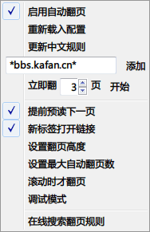

uAutoPagerize2.uc.js
====================

uAutoPagerize 中文规则简化改进版，原作者链接：[Griever/userChromeJS](https://github.com/Griever/userChromeJS/tree/master/uAutoPagerize)。跟 [uAutoPagerize](../uAutoPagerize) 比

 - 基于日文原版重新改写。
 - 兼容 Super_preloader 规则。
 - **中文规则数据库**为：[Super_preloaderPlus_one for Greasemonkey](https://greasyfork.org/scripts/293-super-preloaderplus-one)，这是我用于其它浏览器的翻页脚本 + 数据库。
 - **按钮默认位置**为地址栏，修改代码 `isUrlbar: 0` 则为可移动按钮。
 - 新增 `添加下一页到历史记录`。
 - 新增 `鼠标双击或按键暂停翻页`，在配置文件中。
 - 文件 `_uAutoPagerize.js` 是自己的配置文件。但里面的 EXCLUDE（黑名单）已经不可用，改在右键菜单里设置，存储在 about:config 中。
 - 文件 `uSuper_preloader.db.js` 是中文规则数据库文件，每次更新后被覆盖。
 - 无多功能的分隔条，无强制翻页。
 - **百度贴吧早已经不再支持，请改用 [Tieba Preload - Greasy Fork](https://greasyfork.org/scripts/282-tieba-preload) 脚本。**


### 右键菜单



### 分隔条


### 首选项


	
使用技巧和说明
--------------

- 默认为附加组件栏，可通过 `isUrlbar` 更改，0 为附加组件栏，1 为地址栏
- 文件 *_uAutoPagerize.js* 为自定义配置文件，自定义规则放在这里。
- 文件 *uSuper_preloader.db.js* 为中文规则数据库文件，会被下载替换。
- 鼠标中键点击图标会同时载入配置文件和中文规则数据库文件。
- 如果配置文件修改了，刷新页面会重新载入。

### 其它说明

- 百度如果无法翻页，请清除 cookie
- 贴吧下一页有问题，可改用脚本 [Tieba Preload for Greasemonkey](http://userscripts.org/scripts/show/423917)
- [uAutoPagerizeUI](uAutoPagerizeUI)：图形管理规则，待完善。

### uc 脚本与 GM 脚本的问题

- GM 脚本不支持一些特殊的如 Google 搜索（详细如下）和水木社区页面，而 uc 脚本无此问题。

### Google 搜索的问题

[Super_preloaderPlus_one](http://userscripts.org/scripts/show/178900) 脚本不支持从 Google 主页搜索的翻页，只能用这样的搜索

	https://www.google.com/search?q=firefox

这几类都不支持

	https://www.google.com/#newwindow=1&q=firefox
	https://www.google.com/webhp?hl=en&tab=ww&ei=dhFeUuHaBo2aiAeNm4CgCw&ved=0CBgQ1S4#hl=en&newwindow=1&q=firefox

### 原 json 数据库

uAutoPagerize2 默认禁用原 json 数据库（国外网站为主），如需启用，修改代码

	var SITEINFO_IMPORT_URLS = [
	    // 'http://wedata.net/databases/AutoPagerize/items.json'
	];
为

	var SITEINFO_IMPORT_URLS = [
	    'http://wedata.net/databases/AutoPagerize/items.json'
	];

### ipages 参数的使用

示例：打开百度后立即加载3页。

    {
        // 通过更改 pageElement 解决清爽百度的问题
        name: '百度搜索',
        url: "^https?://www\\.baidu\\.com/(?:s|baidu)\\?",
        nextLink: '//p[@id="page"]/a[contains(text(),"下一页")][@href]',
        pageElement: 'css;div#content_left',
        stylish: '.autopagerize_page_info { margin-bottom: 10px; }',
        ipages: [true, 3]
    },


SITEINFO_Writer.uc.js
--------------------

规则辅助工具，原作者链接：[SITEINFOを書く.uc.js](https://gist.github.com/Griever/1044551)。

- 略加改进的选取 xpath 生成
- xpath 正确与否的颜色提示
- 简易自动补全
- 右键查看元素、查看元素（Firebug）
- 其它看图


手势调用（FireGestures）
-----------------------

启用禁用

```js
	uAutoPagerize.toggle()
```

启用禁用（仅当前页面）

```js
	if (content.ap) content.ap.stateToggle();
```

立即加载3页

```js
	var node = FireGestures.sourceNode;
	var doc = node.ownerDocument || getBrowser().contentDocument;
	var win = doc.defaultView;

	if(win.ap)
	    win.ap.loadImmediately(3);
```

增强型后退，没前进翻到上一页

```js
	var doc = FireGestures.sourceNode.ownerDocument;
	var win = doc.defaultView;
	
	// 删除下面这部分（到空行为止） 则为普通的上一页
	var nav = gBrowser.webNavigation;
	if (nav.canGoBack) {
	    nav.goBack();
	    return;
	}
	
	if (win.uSuper_preloader) {
		win.uSuper_preloader.back();
	} else if (window.nextPage) {  // nextPage.uc.js
		window.nextPage.next();
	} else {
		SuperPreloaderPrevPage();
	}

	// SuperPreloader 脚本的上一页
	function SuperPreloaderPrevPage(){
	    var event = doc.createEvent('HTMLEvents');
	    event.initEvent('superPreloader.back', true, false);
	    doc.dispatchEvent(event);
	}
```

增强型前进，没前进翻到下一页

```js
	var doc = FireGestures.sourceNode.ownerDocument;
	var win = doc.defaultView;
	
	// 删除下面这部分（到空行为止） 则为普通的下一页
	var nav = gBrowser.webNavigation;
	if (nav.canGoForward) {
	    nav.goForward();
	    return;
	}

	if (win.ap && win.ap.requestURL) {
	    win.location = win.ap.requestURL;
	} else if (win.uSuper_preloader) {
	    win.uSuper_preloader.go();
	} else if (window.nextPage) {  // nextPage.uc.xul
	    nextPage.next(true);
	} else {
		SuperPreloaderNextPage();
	}

	// SuperPreloader 脚本的下一页
	function SuperPreloaderNextPage(){
	    var event = doc.createEvent('HTMLEvents');
	    event.initEvent('superPreloader.go', true, false);
	    doc.dispatchEvent(event);
	}
```

向上滚一页（5合1）

依次查找：uAutoPagerize、uSuper_preloader.uc.js、小说阅读脚本、Super_preloader 脚本、FireGestures滚到底部。

```js
	var srcNode = FireGestures.sourceNode;
	var doc = srcNode.ownerDocument || getBrowser().contentDocument;
	var win = doc.defaultView;

	if (win.ap) {
	    uAutoPagerize.gotoprev(win);
	} else if (win.uSuper_preloader) {
	    win.uSuper_preloader.goPre();
	} else if (uAutoPagerize && doc.body && doc.body.getAttribute("name") == "MyNovelReader") { // 小说阅读脚本
	    uAutoPagerize.gotoprev(win, ".title");
	} else if (doc.getElementById("sp-fw-container")) { // Super_preloader 脚本版
	    uAutoPagerize.gotoprev(win, ".sp-separator");
	} else {
	    FireGestures._performAction(event, "FireGestures:ScrollTop");
	}
```

向下滚一页（5合1）

同上

```js
	var srcNode = FireGestures.sourceNode;
	var doc = srcNode.ownerDocument || getBrowser().contentDocument;
	var win = doc.defaultView;

	if (win.ap) {
	    uAutoPagerize.gotonext(win);
	} else if (win.uSuper_preloader) {
	    win.uSuper_preloader.goNext();
	} else if (uAutoPagerize && doc.body && doc.body.getAttribute("name") == "MyNovelReader") { // 小说阅读脚本
	    uAutoPagerize.gotonext(win, ".title");
	} else if (doc.getElementById("sp-fw-container")){  // Super_preloader 脚本版
	    uAutoPagerize.gotonext(win, ".sp-separator");
	} else {
	    FireGestures._performAction(event, "FireGestures:ScrollBottom");
	}
```