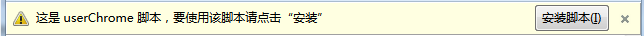
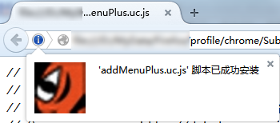
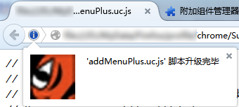
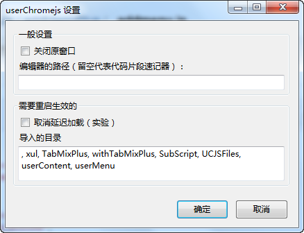
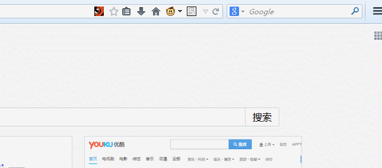

userChromeJS Mix 扩展
====================

**userChromeJS Mix 扩展 = userChromeJS 扩展 + userChrome.js + rebuild_userChrome.uc.xul + SaveUserChromeJS.uc.js**

 - userChromeJS 扩展为[官方的版本](http://userchromejs.mozdev.org/)。
 - userChrome.js 为 [Alice0775 的修改版](https://github.com/alice0775/userChrome.js)。
 - UC脚本管理器为 [dannylee 的UC脚本管理器（2014.4.29版）](https://g.mozest.com/thread-41292-1-4) 的修改版。
 - **安装后会自动更新，不再需要下载附件更新。**
 - 版本 1.5 以上有了大幅改进。

注意
----

 - 如果你需要按钮在地址栏的，请使用 [url-addon-bar](https://addons.mozilla.org/zh-cn/firefox/addon/url-addon-bar/) 扩展实现。
 - 如果 chrome 目录下已经存在 rebuild_userChrome.uc.xul，请手动删除。
 - 由于扩展的更新机制会移除原有的再安装，如果在 content 里面放了文件，更新后会消失。
 - 如果没用过 Alice0775 版的 userChrome.js，里面的 uc 脚本可能存在失效的问题。
 - ~~第一次使用需要从定制拖出。~~

镜像
----

 - [直接下载地址](https://github.com/ywzhaiqi/userChromeJS/raw/master/userChromeJS_Mix.xpi/userChromeJS_Mix.xpi)
 - [卡饭链接地址](http://bbs.kafan.cn/thread-1753671-1-1.html)
 - [github 地址](https://github.com/ywzhaiqi/userChromeJS/tree/master/userChromeJS_Mix.xpi)

更新
----

详见 [updateInfo.md](updateInfo.md)

反馈的问题
-----------

- 使用了 zAutoPopup.uc.xul 后，滑过重启按钮，还没按下去便关了菜单。

1.5 以上说明
-----------

### 几个注意事项

 - 这是一个测试版，由于本人水平有限，可能存在问题，请慎用。
 - 内置了 userChrome.js 文件（由于修改了里面的内容），所以会强制对 chrome 目录下的 chrome.js 文件改名，可手动删除。

### 新增了以下几个功能

 - 安装脚本
    - 在浏览中打开 uc 脚本会出现 **安装工具条**。点击安装按钮后，会自动安装（保存该脚本，然后载入）。
    - 对不存在的脚本会直接安装（无需重启），只是很难判断是否为不存在的脚本，目前是根据id 或文件名判断，如果出现重复添加菜单等情况，请手动重启。
    - 菜单蓝色为无需重启的脚本。
    - 对无需重启的脚本，会直接生效。
    - 对非主窗口的脚本，会直接生效。
 - 卸载脚本
    - 在脚本的菜单上 Ctrl + 右键卸载。
    - 对无需重启的脚本，会直接生效，但并不是完全彻底的卸载，如果需要请手动重启。
    - 对非主窗口的脚本，会直接生效。
    - **注意：卸载脚本同时会删除文件。**
 - 启用禁用脚本
    - 对无需重启的脚本，会直接生效。
    - 对非主窗口的脚本，会直接生效（默认就支持）。
 - 设置界面
 - 编辑器路径为空则用 **代码片段速记器** 打开。

*注：这里的无需重启的脚本指主窗口脚本，非主窗口脚本本身就支持无需重启。*

### 无需重启（restartless）脚本的说明

非主窗口的脚本默认支持无需重启，这里说的是主窗口的脚本。

主窗口的需要脚本支持，在支持的脚本中添加以下2个参数即可。

    // @startup        window.uAutoPagerize.init();
    // @shutdown       window.uAutoPagerize.destroy();

目前支持的脚本有：

- 非主窗口的脚本
- addMenuPlus.uc.js
- uAutoPagerize2.uc.js
- youkuantiadsModY.uc.js
- SimpleDragModY.uc.js
- SimpleMusicPlayer.uc.js
- SITEINFO_Writer.uc.js