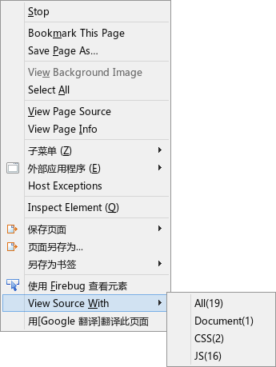

viewSourceModoki.uc.js
======================

右键菜单增加 View Source With: All、Document、css、js

 - 需要在 about:config 中设置 view_source.editor.path 路径。
 - 自行增加样式，设置选择框的大小，具体如下
 - Document 点击后需要等待，不要急着点击第二下

## 选择框样式

	@-moz-document url(chrome://global/content/selectDialog.xul) {
		dialog,
		listbox {
		  height:600px !important;
		  width:51em !important;
		  overflow:auto !important;
		}
	}